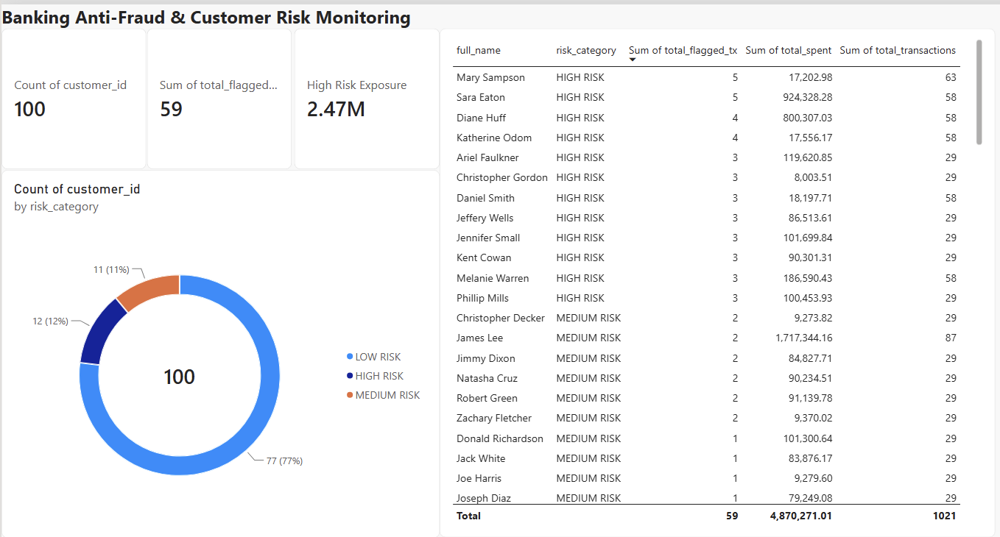

# 🏦 Banking DWH & Anti-Fraud Analytical Pipeline


A synthetic data pipeline and analytical layer modeling a retail banking data warehouse (DWH) for fraud detection, operational monitoring, and risk scoring.



---

## 🚀 Quickstart (Recommended: Docker)

Spin up the containerized PostgreSQL DWH, provision database schemas, and trigger synthetic batch generation with a single command:

```bash
# 1. Clone the repository
git clone https://github.com/dannygavrilyak/bank-structured-data.git
cd bank-structured-data

# 2. Build and start services in detached mode
docker compose up --build -d
```

### Exposed Services & Endpoints

* **PostgreSQL DWH:** `localhost:5432` (Database: `bank_dwh`, User: `postgres`)
* **Pipeline Service:** Automatically applies DDL migrations (`00_init_schema.sql`), generates seeded data batches, and gracefully exits.

---

## 🛠️ Manual Installation (Without Docker)

---

## 🏗️ Architecture & Data Flow

* **Ingestion Layer (`/src` & `main.py`)**: Decoupled Python ETL pipeline leveraging SQLAlchemy, Pandas, and Faker to seed a relational PostgreSQL schema preserving foreign keys, chronological logic, realistic weighted distributions, and **PII data masking (SSN obfuscation, `***-**-####`)** for regulatory compliance.
* **Analytical Layer (`/sql`)**:
  * `01_fraud_monitoring.sql`: Merchant failure rate analysis using conditional aggregation (`COUNT CASE WHEN`).
  * `02_velocity_checks.sql`: Rapid succession detection using window functions (`LAG()`) to flag potential card abuse within 10-minute thresholds.
  * `03_customer_risk_mart.sql`: Customer risk profiling view (`v_customer_risk_profile`) calculating transactional volume, ticket sizes, and behavioral risk scoring (`HIGH`, `MEDIUM`, `LOW`).
* **Reporting Layer (Power BI)**: Executive risk dashboard built on top of the curated `v_customer_risk_profile` data mart, decoupling BI workloads from transactional OLTP.

> **Note on data flow:** The dashboard currently loads via a CSV export of `v_customer_risk_profile` rather than a live PostgreSQL connector. This is a deliberate workaround for the local dev setup (Power BI Desktop runs in a Windows VM under Parallels, while PostgreSQL runs on the macOS host) — not a limitation of the data model itself, which is fully queryable live.

### Database Schema (ERD)


## 💻 Tech Stack

* **Database**: PostgreSQL (Containerized via Docker)
* **Languages & Libraries**: Python 3.11+, Pandas, SQLAlchemy, psycopg2-binary, Faker
* **CI/CD & Code Quality**: GitHub Actions, Ruff Linter
* **Business Intelligence**: Power BI Desktop, DAX
* **Environment & Orchestration**: Docker Compose, Virtualenv, Git (Conventional Commits)

---

## 📊 Power BI Dashboard & Risk Insights

### Core DAX Metric

```dax
High Risk Exposure = 
CALCULATE(
    SUM('customer_risk_mart'[total_spent]), 
    'customer_risk_mart'[risk_category] = "HIGH RISK"
)
```

### Key Business Insights

* **Exposure concentration:** 12% of the customer base (high-risk segment) accounts for $2.47M in flagged financial volume — a disproportionate share relative to headcount.
* **Recommendation:** Prioritize manual review and enhanced authentication (e.g. step-up verification) for the HIGH RISK segment first, since it concentrates the largest share of exposure per customer — the highest-impact, lowest-effort mitigation given limited review capacity.

---

## 🔍 Analytical Marts & Monitoring Queries

Run fraud detection and velocity check queries against the populated warehouse:

* `sql/01_fraud_monitoring.sql`: Merchant failure rate & abnormal reversal metrics.
* `sql/02_velocity_checks.sql`: Rapid-succession transaction patterns via window functions (`LAG()`).
* `sql/03_customer_risk_mart.sql`: Production view (`v_customer_risk_profile`) for automated risk categorization.
